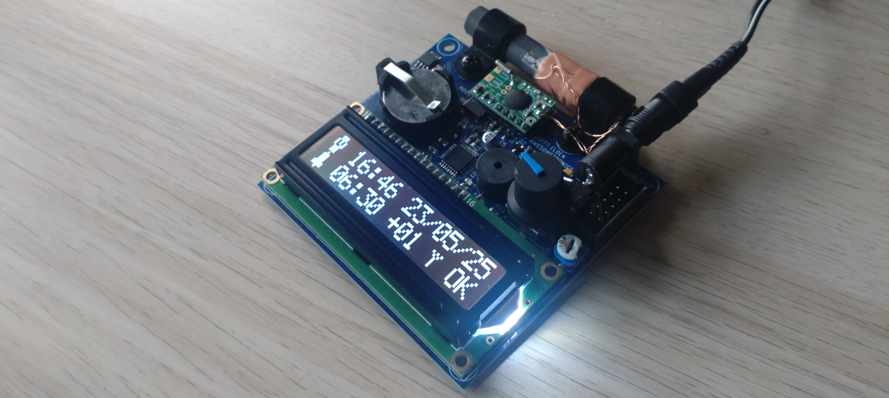

# dcf77-clock 

**DCF77-controlled** radio clock project based on the **ATmega88** microcontroller, **MAS6181B** AM receiver, and **DS1307** RTC.

**Capabilities:**
* Time and date display
* Alarm handling
* Manual date and time setting
* Automatic periodic synchronization with the DCF77 signal
* Time synchronization status display
* Time zone configuration
* DCF77 signal parameters preview during synchronization
* Time and date data available over the serial port
* Time and date retention powered by a CR2032 battery
  
**Hardware:**
* ATmega88
* MAS6181B DCF77 receiver
* DS1307 RTC + CR2032
* 2x16 HD44760 LCD
* Rotary Encoder + Button + LED + Buzzer

**Firmware:**
* C11
* Custom MCU peripheral and external circuit drivers

## Documentation

* [User manual](docs/user_manual.md)

## Tools
* CMake 3.20.0
* Ninja 1.11.1 
* AVR_8_bit_GNU_Toolchain_3.7.0.1796 GNU 7.3.0
* AVRDUDE v7.0
* USBASP drivers libusb_1.2.4.0

## Build

### Generate ninja files
`cmake --preset <hw_version>`

### Build project
`cmake --build --preset <hw_version>`

## External links
* Hardware repository: https://github.com/mlokcewicz/dcf77-clock-pcb

## License

This project is licensed under the Apache License 2.0 - see the [LICENSE](./LICENSE) file for details.
