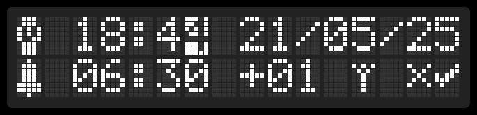

# DCF77 Clock User Manual

There are 3 available screens:
* **Main screen** – displays the time, date, timezone, and synchronization status.
* **Settings screen** – allows you to change the time, date, and timezone or request remote time synchronization.
* **DCF signal status screen** – displays detailed DCF signal data.

## Main screen

The **bell icon** indicates whether the alarm is enabled (filled means enabled).

The `OK / --` message near the **antenna icon** shows the last synchronization status with the DCF77 signal.

Synchronization is performed daily at **04:00**.

Push the rotary encoder to disable the alarm.

## DCF signal status screen

To switch between the time/date display and synchronization info screen – rotate the **rotary encoder**.

Several pieces of information about the DCF77 signal are displayed:
* last bit / break time in ms
* current bit number
* current frame reception status (`WAITING`, `STARTED`, `SYNCED`, or `ERROR`)

The LED state corresponds to the current DCF signal value.

## Settings screen

To switch to the settings screen, push the **rotary encoder**.

Select the value you want to change and confirm by pushing the encoder.

Set the desired value and push the encoder again to return.

Confirm or cancel by selecting the CANCEL/OK icon and confirming by pushing the encoder.

There is also the option to force a radio synchronization by clicking the **antenna icon**.

## Receiving time information via serial port

The device transmits the current timestamp every second via the serial port ('9600 baud, 8N1, no flow control').

The following structure is transmitted:

| Byte | Field   | Description                  | Range        |
|:------|:----------|:------------------------------|:--------------|
| 0    | `seconds`  | Seconds (binary)                | 0–59          |
| 1    | `minutes`  | Minutes (binary)                | 0–59          |
| 2    | `hours`    | Hours (binary, 24-hour format)  | 0–23          |
| 3    | `reserved` | reserved                        | -             |
| 4    | `date`     | Day of the month                | 1–31          |
| 5    | `month`    | Month                           | 1–12          |
| 6    | `year`     | Year (0–99)                     | 0–99          |

**Byte 0 is sent first, followed by Byte 1 up to Byte 6.**

All values are transmitted as **binary-coded 8-bit unsigned integers**.
